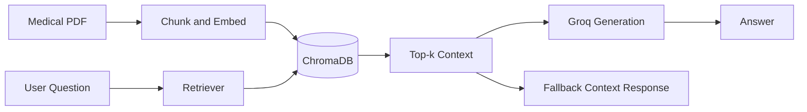

# Medical RAG Chatbot

<p align="center">
  Professional medical document Q&A assistant powered by Groq and ChromaDB
</p>

<p align="center">
  <a href="https://medical-rag-chatbot-9n3fqenxcmlwuixpeszhs8.streamlit.app/">Live Streamlit App</a>
</p>

## Table of Contents

- [Overview](#overview)
- [For Non-Technical Readers](#for-non-technical-readers)
- [How It Works](#how-it-works)
- [Architecture](#architecture)
- [Key Features](#key-features)
- [Tech Stack](#tech-stack)
- [Project Structure](#project-structure)
- [Local Setup](#local-setup)
- [Deploy to Streamlit Cloud](#deploy-to-streamlit-cloud)
- [Troubleshooting](#troubleshooting)
- [Security and Privacy](#security-and-privacy)
- [Optional AWS CI/CD Deployment](#optional-aws-cicd-deployment)
- [Acknowledgments](#acknowledgments)

## Overview

Medical RAG Chatbot is a retrieval-augmented assistant that answers questions
from your medical PDF knowledge base.

It uses:
- Groq for fast language model responses.
- ChromaDB as a local vector database for semantic search.
- Streamlit for an easy web interface.
- Flask support for optional API/web runtime.

## For Non-Technical Readers

Think of this app as a smart search assistant for a medical textbook:

1. It reads and organizes the medical PDF into many searchable pieces.
2. When you ask a question, it finds the most relevant pieces first.
3. It uses those pieces to generate a focused answer.
4. If the AI service is unavailable, it still shows relevant context from the
   document so you are not blocked.

Important note:
- This tool is for information support only.
- It is not a replacement for professional medical advice or diagnosis.

## How It Works

1. Ingestion: PDF documents are loaded and split into chunks.
2. Embedding: Chunks are converted into vector representations.
3. Storage: Vectors are stored in a ChromaDB collection.
4. Retrieval: Top relevant chunks are selected for each user question.
5. Generation: Groq produces a concise answer grounded in retrieved context.

## Architecture



## Key Features

- Retrieval-first design for grounded answers.
- Groq fail-fast behavior to reduce long wait times.
- Automatic fallback response when generation is unavailable.
- Streamlit runtime key diagnostics for easier setup.
- Batched Chroma ingestion to avoid large-batch failures.
- Single deployment branch (`main`) to reduce confusion.

## Tech Stack

- Python
- Streamlit
- Flask
- LangChain
- Groq
- ChromaDB
- Sentence Transformers

## Project Structure

```text
.
|- app.py                    # Flask entrypoint (Streamlit-safe fallback)
|- streamlit_app.py          # Streamlit entrypoint (recommended)
|- store_index.py            # Build/update Chroma index
|- src/
|  |- config.py              # Environment and runtime settings
|  |- helper.py              # Load/split/embed documents
|  |- index_builder.py       # Chroma collection build and batching
|  |- prompt.py              # System prompt template
|  |- rag_pipeline.py        # Retriever and Groq answer flow
|  |- webapp.py              # Flask app routes
|- data/                     # PDF source files
|- static/                   # UI assets
|- templates/                # Flask templates
|- requirements.txt          # Python dependencies
|- runtime.txt               # Python runtime for Streamlit Cloud
```

## Local Setup

### Prerequisites

- Python 3.11
- Git

### 1) Clone

```bash
git clone https://github.com/sillyfellow21/Medical-RAG-Chatbot.git
cd Medical-RAG-Chatbot/my-custom-chatbot
```

### 2) Create and activate environment

Windows (PowerShell):

```powershell
python -m venv .venv
.\.venv\Scripts\Activate.ps1
```

macOS/Linux:

```bash
python3 -m venv .venv
source .venv/bin/activate
```

### 3) Install dependencies

```bash
pip install -r requirements.txt
```

### 4) Configure environment

Create `.env` in `my-custom-chatbot/`:

```ini
GROQ_API_KEY="your_groq_api_key"
CHROMA_PERSIST_DIR="chroma_db"
CHROMA_COLLECTION="medical-chatbot"
```

### 5) Build vector index

```bash
python store_index.py
```

### 6) Run app

Streamlit (recommended):

```bash
streamlit run streamlit_app.py
```

Flask (optional):

```bash
python app.py
```

## Deploy to Streamlit Cloud

### Required settings

1. Repository: `sillyfellow21/Medical-RAG-Chatbot`
2. Branch: `main`
3. Main file path: `streamlit_app.py`
4. Python runtime: from `runtime.txt` (`python-3.11`)

### Secrets (Streamlit Cloud)

Add in App Settings -> Secrets:

```toml
GROQ_API_KEY="your_groq_api_key"
```

### After changes

Always run:

1. Clear cache
2. Reboot app

## Troubleshooting

### No calls visible in Groq console

Possible reasons:
- `GROQ_API_KEY` is not set in Streamlit Cloud Secrets.
- Wrong Streamlit entrypoint is selected.
- App is running fallback-only mode.

Check in app sidebar:
- Open `Key diagnostics` and confirm Groq key detection.
- Verify warning messages about fallback mode.

### App says "Missing GROQ_API_KEY"

1. Add secret exactly as `GROQ_API_KEY`.
2. Save secrets.
3. Clear cache and reboot.

### Slow responses / "Thinking" too long

- First run may be slower due to warm-up and indexing.
- If Groq times out, app falls back to retrieval snippets.

### Batch size ValueError in Chroma

- Fixed by batched ingestion in `src/index_builder.py`.
- Pull latest `main`, then clear cache and rebuild index.

### Entry file confusion

- Streamlit Cloud main file must be `streamlit_app.py`.
- `app.py` is primarily Flask runtime.

## Security and Privacy

- `.env` is git-ignored and should never be committed.
- Keep API keys only in local `.env` or Streamlit Secrets.
- Do not share keys in screenshots, logs, or chat.
- If a key is exposed, rotate it immediately.

## Optional AWS CI/CD Deployment

This repo includes a GitHub Actions workflow for AWS container deployment.

High-level flow:

1. Build Docker image from source.
2. Push image to Amazon ECR.
3. Pull image on EC2 self-hosted runner.
4. Run container with required environment variables.

Typical GitHub Secrets:

- `AWS_ACCESS_KEY_ID`
- `AWS_SECRET_ACCESS_KEY`
- `AWS_DEFAULT_REGION`
- `ECR_REPO`
- `GROQ_API_KEY`

## Acknowledgments

This project builds on the foundational architecture from:

- Original project:
  https://github.com/entbappy/Build-a-Complete-Medical-Chatbot-with-LLMs-LangChain-Pinecone-Flask-AWS

Major updates in this version:

- Migrated LLM and vector stack to Groq + ChromaDB.
- Added Streamlit runtime diagnostics and fallback handling.
- Improved deployment stability and branch consistency.
