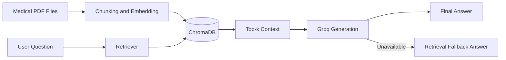

# Medical RAG Chatbot

<p align="center">
  Production-oriented medical document Q&A with retrieval-first grounding, Groq generation, and dual UI support (Streamlit + Flask).
</p>

<p align="center">
  <a href="https://github.com/sillyfellow21/Medical-RAG-Chatbot">Repository</a>
  ·
  <a href="https://medical-rag-chatbot-9n3fqenxcmlwuixpeszhs8.streamlit.app/">Live Streamlit App</a>
</p>

## Problem Statement

Medical PDFs are dense, long, and difficult to search quickly during real-world usage.
Traditional keyword search misses context, while direct LLM chat can hallucinate when not grounded in source material.

This project solves that by implementing a Retrieval-Augmented Generation (RAG) workflow that:
- Retrieves relevant content from a medical knowledge base first.
- Generates responses grounded in retrieved evidence.
- Falls back gracefully to retrieved snippets if model generation is unavailable.

## Outcome

The current solution delivers a practical, deployment-ready assistant with:
- Grounded medical Q&A over indexed PDF content.
- More reliable runtime behavior through explicit fallback paths.
- Faster troubleshooting via runtime key diagnostics in the Streamlit sidebar.
- Cloud-friendly deployment with clear secrets handling and reproducible setup.

Important: This tool supports information access and learning. It is not a substitute for professional medical advice, diagnosis, or treatment.

## Professional UI

This repository includes two interfaces so you can choose a professional experience based on your use case:
- Streamlit UI for rapid product demo and cloud deployment.
- Flask web UI for template-driven interface control.

UI entry points:
- Streamlit app: `streamlit_app.py`
- Flask app: `app.py`
- Flask template: `templates/chat.html`
- Styling assets: `static/style.css`

## Solution Architecture



## Core Features

- Retrieval-first design to reduce ungrounded answers.
- ChromaDB local vector store with persistent collection support.
- Groq-backed answer generation with fail-fast fallback handling.
- Streamlit runtime diagnostics for key presence and setup validation.
- Batched ingestion pipeline to improve indexing stability.
- Optional Flask runtime for template-based UI customization.

## Tech Stack

- Python 3.11
- LangChain
- ChromaDB
- Groq
- Streamlit
- Flask
- Sentence Transformers

## Project Structure

```text
my-custom-chatbot/
|- app.py
|- streamlit_app.py
|- store_index.py
|- src/
|  |- config.py
|  |- helper.py
|  |- index_builder.py
|  |- prompt.py
|  |- rag_pipeline.py
|  |- webapp.py
|- templates/
|  |- chat.html
|- static/
|  |- style.css
|- data/
|- requirements.txt
|- runtime.txt
```

## Quick Start

### 1) Clone repository

```bash
git clone https://github.com/sillyfellow21/Medical-RAG-Chatbot.git
cd Medical-RAG-Chatbot/my-custom-chatbot
```

### 2) Create virtual environment

Windows (PowerShell):

```powershell
python -m venv .venv
.\.venv\Scripts\Activate.ps1
```

macOS/Linux:

```bash
python3 -m venv .venv
source .venv/bin/activate
```

### 3) Install dependencies

```bash
pip install -r requirements.txt
```

### 4) Configure environment

Create a `.env` file in the project root:

```ini
GROQ_API_KEY="your_groq_api_key"
CHROMA_PERSIST_DIR="chroma_db"
CHROMA_COLLECTION="medical-chatbot"
```

### 5) Build vector index

```bash
python store_index.py
```

### 6) Run application

Streamlit (recommended):

```bash
streamlit run streamlit_app.py
```

Flask (optional):

```bash
python app.py
```

## Streamlit Cloud Deployment

Required configuration:
- Repository: `sillyfellow21/Medical-RAG-Chatbot`
- Branch: `main`
- Main file path: `streamlit_app.py`
- Runtime: defined in `runtime.txt`

Set secret in Streamlit App Settings -> Secrets:

```toml
GROQ_API_KEY="your_groq_api_key"
```

After updates, run:
1. Clear cache
2. Reboot app

## Security

- Never commit `.env` or API keys.
- Store production keys in Streamlit Secrets or environment variables.
- Rotate keys immediately if exposed.

## Troubleshooting

- Missing key errors:
1. Confirm `GROQ_API_KEY` is set.
2. Restart app after saving secrets.

- No model response:
1. Verify key validity.
2. Check sidebar diagnostics in Streamlit.
3. App should return retrieval fallback snippets if generation is unavailable.

- Slow first response:
1. Initial embedding/index load may take longer.
2. Subsequent queries are usually faster.

## Acknowledgments

Based on and adapted from the original educational architecture:
- https://github.com/entbappy/Build-a-Complete-Medical-Chatbot-with-LLMs-LangChain-Pinecone-Flask-AWS

This implementation modernizes the stack and deployment path with Groq + ChromaDB and a Streamlit-first delivery model.
